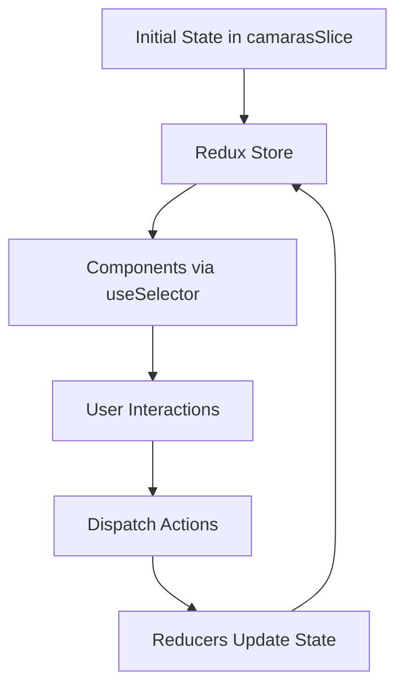

## Overview

The SSEGH Security Cameras application follows a component-based React architecture with Redux Toolkit for state management. The application uses React Router for client-side routing via HashRouter, allowing static deployment without server-side configuration.

## Project Structure

The application is organized into distinct directories, each serving a specific purpose:

```
source/
├── app.js                 # Application entry point
├── components/            # React components
│   ├── main.js           # Main products page
│   ├── principal.js      # Landing page
│   ├── navbarTop.js      # Top navigation
│   ├── navbarAside.js    # Sidebar filters
│   ├── listcam.js        # Camera list display
│   ├── cardscamara.js    # Camera card component
│   ├── viewcamera.js     # Individual camera view
│   ├── filtercamaras.js  # Filtered results
│   ├── contacto.js       # Contact page
│   ├── nosotros.js       # About page
│   ├── notfound.js       # 404 page
│   ├── onload.js         # Loading component
│   └── whatsappIcon.js   # WhatsApp integration
├── store/                 # Redux state management
│   ├── store.js          # Store configuration
│   └── camarasSlice.js   # Camera data slice
├── services/              # External services
│   └── getdata.js        # Data fetching
├── utilities/             # Helper functions
│   ├── const.js          # Constants and imports
│   ├── filterdata.js     # Filter utilities
│   └── otherFunctions.js # Utility functions
└── static/                # Static assets
    ├── estilos.css
    └── images/
```

## Component Hierarchy

The application follows a hierarchical component structure that flows from the root App component:

<Steps>
  <Step title="Root Level">
    The `App` component serves as the application root, wrapped in Redux Provider and React Router.
    
    ```jsx app.js
    const root = ReactDOM.createRoot(document.getElementById("root"))
    root.render(
        <React.StrictMode>
            <Provider store={store}>
                <App />
            </Provider>
        </React.StrictMode>
    )
    ```
  </Step>

  <Step title="Router Level">
    The App component initializes state and renders the HashRouter with NavbarTop and Routes.
    
    ```jsx app.js:14-28
    return(
        data ?  
            <HashRouter  basename="/">
                <NavbarTop/>
                    <Routes>
                        <Route path="/" element={<Principal />}></Route>
                        <Route path="/productos" element={<Main />}></Route>
                        <Route path="/nosotros" element={<Nosotros />}></Route>
                        <Route path="/contacto" element={<Contacto />}></Route>
                        <Route path="*" element={<NotFound />}></Route>
                        <Route path="/productos/camaras/:modelo" element={<ViewCamera />}></Route>
                        <Route path="/productos/camaras/filtro/:filter" element={<FilterCamara />}></Route>
                    </Routes>
            </HashRouter>
        : <OnLoad />
    )
    ```
  </Step>

  <Step title="Page Level">
    Each route renders a page component (Principal, Main, Nosotros, Contacto) that manages its layout.
  </Step>

  <Step title="Feature Components">
    Page components compose smaller feature components like NavbarAside, ListCam, and CardsCamara.
    
    ```jsx components/main.js:12-22
    return(
        <div className="col-12">
            <div className="container">
                <div className="row">
                    <NavbarAside camaras={data}/>
                    <ListCam camaras={data}/>
                    <WhatsappIcon />
                </div>
            </div>
        </div>
    )
    ```
  </Step>
</Steps>

## Architectural Patterns

### Container/Presentation Pattern

The application separates container components (that manage state) from presentational components (that render UI):

- **Container components**: `Main`, `ViewCamera`, `FilterCamara` connect to Redux and manage data flow
- **Presentation components**: `CardsCamara`, `ListCam`, `NavbarOptionsTop` receive props and render UI

### State Management Architecture

The application uses Redux Toolkit for centralized state management:

```jsx store/store.js
const {configureStore} = RTK

const store = configureStore({
    reducer: {
        camaras: camarasSlice.reducer
    }
})
```

All camera data and filtering logic lives in the Redux store, accessible to any component via `useSelector` and `useDispatch` hooks.

### UMD Module Pattern

The application loads React, Redux, and React Router as UMD (Universal Module Definition) modules via CDN:

```html index.html:29-39
<script src="https://unpkg.com/react@18.0.0/umd/react.development.js"></script> 
<script src="https://unpkg.com/react-dom@18.2.0/umd/react-dom.development.js"></script> 
<script src="https://unpkg.com/@babel/standalone/babel.min.js"></script>
<script src="https://unpkg.com/react-router-dom@6.18.0/dist/umd/react-router-dom.development.js"></script>
<script src="https://unpkg.com/react-redux@8.0.5/dist/react-redux.min.js"></script>
<script src="https://unpkg.com/@reduxjs/toolkit@1.9.3/dist/redux-toolkit.umd.js"></script>
```

<Note>
  This architecture allows the application to run without a build step, making it easy to deploy as static files.
</Note>

## Data Flow

The application follows unidirectional data flow:



<Steps>
  <Step title="Initialization">
    Camera data is defined in `camarasSlice.js` as `initialState` and loaded into the store.
  </Step>

  <Step title="Component Access">
    Components access state using the `useSelector` hook:
    
    ```jsx components/main.js:10
    const data = useSelector((state) => state.camaras)
    ```
  </Step>

  <Step title="State Updates">
    User interactions trigger actions via `useDispatch`:
    
    ```jsx components/main.js:6-8
    useEffect(() => {
        dispatch(backToInitialState('reset'))
    }, [dispatch])
    ```
  </Step>

  <Step title="Reducer Processing">
    Reducers in `camarasSlice` process actions and return updated state, triggering component re-renders.
  </Step>
</Steps>

## File Organization Principles

### Components Directory

Components are organized by feature and page:

- **Navigation components**: `navbarTop.js`, `navbarAside.js`
- **Product display**: `listcam.js`, `cardscamara.js`, `viewcamera.js`
- **Pages**: `principal.js`, `contacto.js`, `nosotros.js`
- **Utilities**: `onload.js`, `notfound.js`, `whatsappIcon.js`

### Constants and Configuration

The `utilities/const.js` file centralizes imports and constants:

```javascript utilities/const.js:1-12
const ITEMS_NAV_TOP = ["Productos", "Nosotros", "Contacto"]
const FIELDS_CARD = ["diseño", "resolucion", "conectividad", "marca", "tipo_de_camara"]

const Routes = ReactRouterDOM.Routes
const Route = ReactRouterDOM.Route
const BrowserRouter = ReactRouterDOM.BrowserRouter
const Link = ReactRouterDOM.Link
const Navigate = ReactRouterDOM.Navigate
const HashRouter = ReactRouterDOM.HashRouter
const useLocation = ReactRouterDOM.useLocation
const useNavigate = ReactRouterDOM.useNavigate
const useParams = ReactRouterDOM.useParams
```

<Tip>
  This centralized approach makes it easy to update library references and shared constants across the application.
</Tip>

## Loading Strategy

The application implements a loading state to ensure data is available before rendering:

```jsx app.js:3-12
const App = () => {
    const {useState, useEffect} = React;
    const [data, setData] = useState(null)
    const {useSelector} = ReactRedux
    const camaras = useSelector((state) => state.camaras)
        
    useEffect(() => {
        setData(camaras)
    }, [])

    return(data ? <HashRouter>...</HashRouter> : <OnLoad />)
}
```

This ensures users see a loading indicator until the application is ready to display content.

## Next Steps

<CardGroup cols={2}>
  <Card title="Routing" icon="route" href="/concepts/routing">
    Learn how React Router manages navigation and dynamic routes
  </Card>
  <Card title="State Management" icon="database" href="/concepts/state-management">
    Explore Redux Toolkit configuration and state flow
  </Card>
</CardGroup>