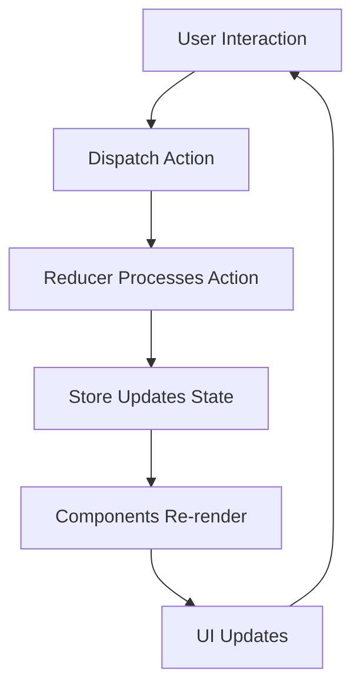

## Overview

The SSEGH Security Cameras application uses Redux Toolkit (RTK) for centralized state management. Redux Toolkit simplifies Redux configuration and provides powerful utilities for managing camera data and filters.

## Store Configuration

The Redux store is configured in `store/store.js` using Redux Toolkit's `configureStore`:

```javascript store/store.js
const {configureStore} = RTK

const store = configureStore({
    reducer: {
        camaras: camarasSlice.reducer
    }
})
```

<Info>
  Redux Toolkit's `configureStore` automatically sets up the Redux DevTools extension and includes middleware like Redux Thunk.
</Info>

### Provider Setup

The store is provided to the React application through the Provider component:

```jsx app.js:32-39
const root = ReactDOM.createRoot(document.getElementById("root"))
root.render(
    <React.StrictMode>
        <Provider store={store}>
            <App />
        </Provider>
    </React.StrictMode>
)
```

This makes the store accessible to all components via React-Redux hooks.

## State Structure

The application maintains a single state slice called `camaras` containing an array of camera objects:

```javascript
{
  camaras: [
    {
      id: 1,
      marca: "imou",
      dimensiones: "93.4 mm × 79.4 mm",
      vision_nocturna: "No",
      camara_inteligente: "No",
      descripcion: "...",
      diseño: "Interior",
      resolucion: "4 mp",
      conectividad: "Wifi",
      tipo_de_camara: "Domo",
      modelo: "IPC-TA42P-D",
      imagenes: ["..."]
    },
    // ... more cameras
  ]
}
```

## Camaras Slice

The `camarasSlice` manages all camera-related state using Redux Toolkit's `createSlice`:

```javascript store/camarasSlice.js:151-191
const camarasSlice = createSlice({
    name: "camaras",
    initialState,
    reducers: {
        filterCamara:(state, action) => {
            const id = action.payload
            return state.filter((camara) => camara.id === id)
        },
        filterModelo:(state, action) => {
            const modelo = action.payload
            return state.filter((camara) => camara.modelo === modelo)
        },
        filterCamarasAside:(state, action) => {
            const value = action.payload
            let new_state = []
            for(let cam of state){
                Object.values(cam).forEach((value_state) => {
                        if (capitalize(value[0]) === value_state) new_state.push(current(cam))
                    }
                )
            }
            if(value.length > 1){
                //son mas filtros
                new_state = new_state.filter((element, index, array) =>
                    //cheackeamos que cada uno cumpla la condicion    
                    value.every( filtro => {
                            return Object.values(element).includes(capitalize(filtro))
                        })
                    )
            }
            return new_state
        },
        returnPreviousState: (state, action) => {
            camarasSlice.caseReducers.backToInitialState(state, action)
        },
        backToInitialState:(state, action) => {
            return [...initialState]
        }
    }
})

const {filterCamara, filterModelo, backToInitialState, filterCamarasAside, returnPreviousState} = camarasSlice.actions
```

<Note>
  Redux Toolkit's `createSlice` automatically generates action creators and action types based on the reducer names.
</Note>

### Initial State

The initial state contains hardcoded camera data:

```javascript store/camarasSlice.js:3-148
const initialState = [
    {
        "id":1,
        "marca":"imou",
        "dimensiones":"93.4 mm × 79.4 mm",
        "vision nocturna":"No",
        "camara inteligente":"No",
        "descripcion":"Resolución: 4MP 2K (2560 x 1440)...",
        "diseño":"Interior",
        "resolucion":"4 mp",
        "conectividad":"Wifi",
        "tipo_de_camara":"Domo",
        "modelo":"IPC-TA42P-D",
        "imagenes":[
            "https://raw.githubusercontent.com/eduardo24cba/dataSsegh/main/imagenes/IPC-TA42P-D.jpeg"
        ]
    },
    // ... 8 more cameras
]
```

## Reducers

The slice defines five reducer functions that handle different state operations:

### filterCamara

Filters the camera array by ID:

```javascript store/camarasSlice.js:155-158
filterCamara:(state, action) => {
    const id = action.payload
    return state.filter((camara) => camara.id === id)
}
```

<Tip>
  Redux Toolkit uses Immer under the hood, allowing you to write "mutating" logic that is automatically converted to immutable updates.
</Tip>

### filterModelo

Filters cameras by model name, used for displaying individual camera details:

```javascript store/camarasSlice.js:159-162
filterModelo:(state, action) => {
    const modelo = action.payload
    return state.filter((camara) => camara.modelo === modelo)
}
```

**Usage example:**

```jsx components/viewcamera.js:50-52
useEffect( () => {
    dispatch(filterModelo(modelo))
}, [dispatch])
```

### filterCamarasAside

Implements complex multi-filter logic for sidebar filters:

```javascript store/camarasSlice.js:163-182
filterCamarasAside:(state, action) => {
    const value = action.payload
    let new_state = []
    for(let cam of state){
        Object.values(cam).forEach((value_state) => {
                if (capitalize(value[0]) === value_state) new_state.push(current(cam))
            }
        )
    }
    if(value.length > 1){
        //son mas filtros
        new_state = new_state.filter((element, index, array) =>
            //cheackeamos que cada uno cumpla la condicion    
            value.every( filtro => {
                    return Object.values(element).includes(capitalize(filtro))
                })
            )
    }
    return new_state
}
```

<Steps>
  <Step title="Single Filter">
    When one filter is applied, find all cameras matching any property with that value.
  </Step>

  <Step title="Multiple Filters">
    When multiple filters are applied, return only cameras that match ALL filter criteria using `Array.every()`.
  </Step>

  <Step title="Return Filtered State">
    Return the filtered array which replaces the current state.
  </Step>
</Steps>

<Warning>
  The `current` helper from Redux Toolkit is used to get a readable snapshot of the draft state for pushing to arrays.
</Warning>

### backToInitialState

Resets the state to the original camera list:

```javascript store/camarasSlice.js:187-189
backToInitialState:(state, action) => {
    return [...initialState]
}
```

**Usage example:**

```jsx components/main.js:6-8
useEffect(() => {
    dispatch(backToInitialState('reset'))
}, [dispatch])
```

This ensures the `/productos` page always displays all cameras when first loaded.

### returnPreviousState

Calls another reducer to reset state:

```javascript store/camarasSlice.js:183-186
returnPreviousState: (state, action) => {
    camarasSlice.caseReducers.backToInitialState(state, action)
}
```

<Info>
  Redux Toolkit's `caseReducers` property allows one reducer to call another reducer function.
</Info>

## Accessing State in Components

Components access Redux state using the `useSelector` hook from React-Redux:

### Basic Selection

```jsx components/main.js:10
const data = useSelector((state) => state.camaras)
```

This returns the entire `camaras` array from the Redux store.

### Selecting Specific Data

```jsx components/viewcamera.js:48
const [camara] = useSelector((state) => state.camaras)
```

This destructures to get the first camera (useful after filtering by model).

### Component Integration

```jsx app.js:3-12
const App = () => {
    const {useState, useEffect} = React;
    const [data, setData] = useState(null)
    const {useSelector} = ReactRedux
    const camaras = useSelector((state) => state.camaras)
        
    useEffect(() => {
        setData(camaras)
    }, [])

    return(data ? <HashRouter>...</HashRouter> : <OnLoad />)
}
```

## Dispatching Actions

Components dispatch actions using the `useDispatch` hook:

### Getting Dispatch Function

```jsx components/main.js:4
const dispatch = useDispatch()
```

### Dispatching in Effects

```jsx components/main.js:6-8
useEffect(() => {
    dispatch(backToInitialState('reset'))
}, [dispatch])
```

<Tip>
  Always include `dispatch` in the `useEffect` dependency array to satisfy React Hook rules, even though dispatch is stable and won't change.
</Tip>

### Dispatching with Payloads

Pass data to actions via the payload:

```jsx components/navbarAside.js:20
dispatch(filterCamarasAside([key]))
```

The payload is automatically wrapped in an action object:

```javascript
{
  type: 'camaras/filterCamarasAside',
  payload: [key]
}
```

## State Flow

The application follows Redux's unidirectional data flow:



### Complete Flow Example

Here's how filtering works from start to finish:

<Steps>
  <Step title="User Clicks Filter">
    User clicks a filter button in the sidebar:
    
    ```jsx components/navbarAside.js:18-22
    <button className="btn btn-link"
        onClick = {()=> {
            dispatch(filterCamarasAside([key]))
            let url = urlFiltro(key, location)
            navigate(`/productos/camaras/filtro/${url}`)}}
    >{key}</button>
    ```
  </Step>

  <Step title="Action Dispatched">
    The component dispatches the `filterCamarasAside` action with the filter value as payload.
  </Step>

  <Step title="Reducer Executes">
    The reducer filters the camera array based on the payload:
    
    ```javascript store/camarasSlice.js:163-182
    filterCamarasAside:(state, action) => {
        const value = action.payload
        // ... filtering logic
        return new_state
    }
    ```
  </Step>

  <Step title="State Updates">
    The store updates with the filtered camera array.
  </Step>

  <Step title="Components Re-render">
    All components using `useSelector((state) => state.camaras)` receive the updated state and re-render.
  </Step>

  <Step title="UI Updates">
    The `ListCam` component displays only the filtered cameras.
  </Step>
</Steps>

## Redux Toolkit Utilities

The application uses several Redux Toolkit utilities:

### createSlice

Simplifies reducer logic with automatic action creator generation:

```javascript store/camarasSlice.js:1
const {createSlice, current} = RTK;
```

### current

Provides a readable snapshot of draft state:

```javascript store/camarasSlice.js:168
if (capitalize(value[0]) === value_state) new_state.push(current(cam))
```

Without `current`, you'd get a Proxy object instead of the actual camera data.

### configureStore

Sets up the store with good defaults:

```javascript store/store.js:3-7
const store = configureStore({
    reducer: {
        camaras: camarasSlice.reducer
    }
})
```

This automatically includes:
- Redux Thunk middleware for async operations
- Redux DevTools Extension integration
- Immutability and serializability checks in development

## Redux DevTools Integration

<Info>
  Redux Toolkit automatically enables Redux DevTools, allowing you to inspect state changes, time-travel debug, and replay actions.
</Info>

To use Redux DevTools:

1. Install the [Redux DevTools Extension](https://github.com/reduxjs/redux-devtools) in your browser
2. Open the application
3. Open browser DevTools and navigate to the Redux tab
4. Inspect actions, state diffs, and time-travel through state changes

## Common Patterns

### Reset State on Mount

```jsx components/main.js:6-8
useEffect(() => {
    dispatch(backToInitialState('reset'))
}, [dispatch])
```

This pattern ensures components start with clean state when mounted.

### Filter and Navigate

```jsx components/navbarAside.js:19-22
const onClick = () => {
    dispatch(filterCamarasAside([key]))
    let url = urlFiltro(key, location)
    navigate(`/productos/camaras/filtro/${url}`)
}
```

Update Redux state and URL simultaneously to keep them in sync.

### Extract Then Filter

```jsx components/viewcamera.js:44-52
const {useParams} = ReactRouterDOM
const [modelo] = Object.values(useParams())

useEffect( () => {
    dispatch(filterModelo(modelo))
}, [dispatch])
```

Extract URL parameters and use them to filter state on component mount.

## Best Practices

<CardGroup cols={2}>
  <Card title="Keep State Minimal" icon="minimize">
    Store only essential data in Redux. Derive computed values in components or selectors.
  </Card>

  <Card title="Use Redux Toolkit" icon="toolbox">
    Redux Toolkit simplifies Redux with less boilerplate and built-in best practices.
  </Card>

  <Card title="Dispatch in Effects" icon="rotate">
    Use `useEffect` to dispatch actions on mount or when dependencies change.
  </Card>

  <Card title="Select Efficiently" icon="filter">
    Use `useSelector` with specific selectors to prevent unnecessary re-renders.
  </Card>
</CardGroup>

## Next Steps

<CardGroup cols={2}>
  <Card title="Architecture" icon="sitemap" href="/concepts/architecture">
    Learn about the overall application structure
  </Card>
  <Card title="Routing" icon="route" href="/concepts/routing">
    Understand how React Router manages navigation
  </Card>
</CardGroup>